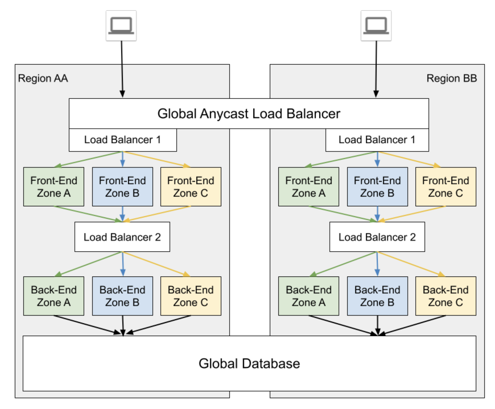
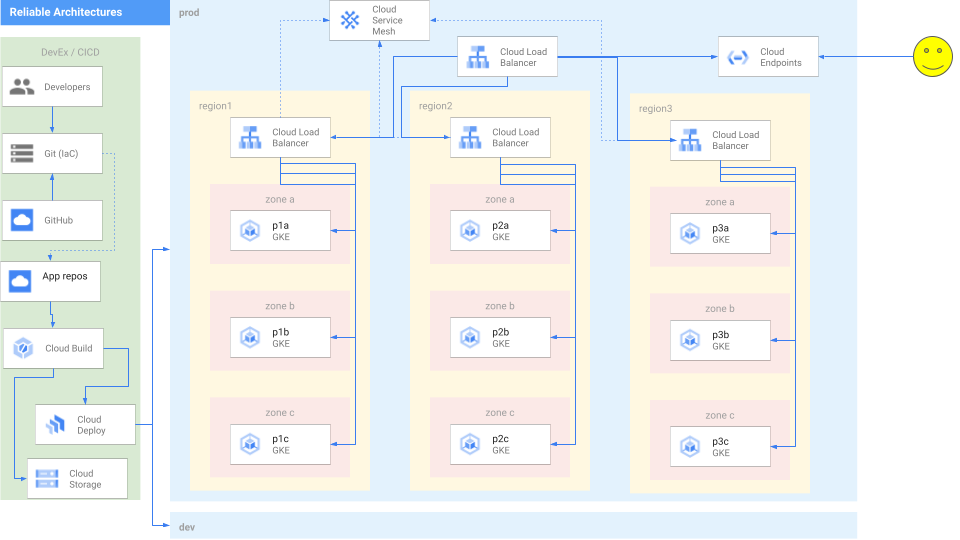

# Reliable App Platforms - on GCP

_Last tested on 04/30/2024 by @stevemcghee

Watch the video of our talk from Google Cloud Next 2024: https://youtu.be/FkIqA9Pt7Hc

Slides are also available as a [pdf](docs/DEV227-Next24.pdf)

[](https://youtu.be/FkIqA9Pt7Hc)


<!--  -->


_Figure: An Archetype: Global Anycast with regional isolated stacks and global database deployment model._



_Figure: An Architecture: The same archetype as deployed on Google Cloud._


This is derived from the whitepaper: [Deployment Archetypes for Cloud Applcations](https://arxiv.org/pdf/2105.00560.pdf)

Also explained here: <https://cloud.google.com/architecture/deployment-archetypes>

## Getting started

1. Clone this repo.

   ```bash
   git clone https://github.com/GoogleCloudPlatform/reliable-app-platforms.git
   cd reliable-app-platforms
   ```

**NOTE** If you want to change any of the infrastructure defaults used in this repo, please follow instructions in the **Deploy the platform infrastructure** section and return to the next step.

1. Define your GCP project ID.

   ```bash
   export PROJECT_ID=<YOUR PROJECT ID>
   export GITHUB_ORG=<mycorp>
   export GITHUB_USER=<myusername>
   export GITHUB_TOKEN=<long-token-goes-here>
   export GITHUB_EMAIL=<user@example.com>
   ```
1. Set the k8s version for your GKE cluster. 
   Go to build/terraform/infra-create-gke.yaml. Select an approriate version from [this](https://cloud.google.com/kubernetes-engine/docs/release-notes) page and pass it along to the startup script.
   If you want to customize the regions and zones you are deploying your infrastructure to, or the subnet ranges used in the cluster, perform the next step. Otherwise jump straight ahead to the kicking off the build with terraform. 

### Customize the platform infrastructure.
To deploy the platform infrastructure, you change some of the default values for the infrastructure deployment to suit the needs of your environment.
1. infra/terraform/vpc/variables.tf:
   1. The variable "fleets" defines the GKE subnet locations, name-prefixes, subnet cidrs. These values can be changed to suit your needs. The 6 GKE workload clusters will later be deployed in this vpc using the subnets created by this module.
   1. The variable "gke_config" defines the GKE subnet locations, name, subnet cidrs for the config cluster(s). These values can be changed to suit your needs. The GKE config cluster will later be deployed in this vpc using the subnets created by this module.

### Kick off the build with terraform

1. Kick off build with terraform

   ```bash
   ./build.sh --k8s <k8s_version>
   ```

1. View build in the Console.

   ```bash
   https://console.cloud.google.com/cloud-build
   ```

   > This step can take 20-30 minutes to complete.


### Deploy an application to the platform
This repo assumes that your application is made up of 1 or more services that may be owned by multiple teams.
This repo assumes that each of the services is stored either in their own repos or in different folders of the same repo. To make the use of this repo easier, try to follow this structure in your own application repos.

The structure assumed is as follows:
1. Application folder/repo
   1. Service-A repo/folder
      1. Application-repo/folder
         1. Source-code folder
         1. k8s folder
      1. Infra-repo/folder
         1. terraform folder
            1. Platform-infra folder
            1. Application-infra folder
            1. SLOs-infra folder
   1. Service-B repo/folder
      1. Application-repo/folder
         1. Source-code folder
         1. k8s folder
      1. Infra-repo/folder
         1. terraform folder
            1. Platform-infra folder
            1. Application-infra folder
            1. SLOs-infra folder
   1. ...

### Infra-repo
The infrastucture repo/folder will contain a terraform folder where all the terraform modules are stored.
1. The Platform-infra folder: Use this folder to create a terraform modules that will consume the following platform modules:
   1. deploy-pipeline: *Required*. You can use this module to define the archetype of the service along with the zones/regions where the service needs to be deployed. 
   1. artifact-registry: *Optional*, if you want an artifact registry to store container images of your service. 
   1. endpoints: *Optional*. If you want your service to have a public URL, this module will allow you to create an endpoint of the form **ENDPOINTNAME.endpoints.<PROJECT_ID>.cloud.goog**. This endpoint will resolve to the IP address of the loadbalancer that acts as a multi-cluster gateway

## Deploy an example application from this repo
Please read *examples/Examples.md* for more info on the structure of the examples.

### Deploy `nginx`.

The **nginx** application is a single service application which by default uses the *Active Passive Zone (APZ)* archetype. 

#### Easiest path (requires a GitHub Org):

```bash

  onboard.sh nginx

```

1. once you've onboarded the app, you'll have a new repo named "$APP-infra". make a single change in that repo (eg: author the README.md) to keep going, creating the next repo named just "$APP".
1. once the "$APP" repo exists, make a small change there to do the first deployment.

(See more in [`modules/onboard-app/README.md`](/modules/onboard-app/README.md) )

**NOTE**: Make sure you update the virtual service file found in */examples/nginx/app-repo/k8s/base/vs.yaml* to point to the endpoint for your application's frontend.  (But: if you use the `onboard.sh` method, this is done for you.)

If you don't use `onboard.sh` you can still deploy  apps manually, see below:

```
spec:
   hosts:
   - "nginxservice.endpoints.$PROJECT_ID.cloud.goog"
```
Run the nginx deploy pipeline:
   ```bash
   
   cd $HOME
   ./deploy.sh --app nginx
   ```
   This will kick of a script that first creates the necessary infrastructure for the application using terraform. 
   The infrastructure created at this step are:
   1. GCP deployment pipelines
   1. Endpoints
   1. Artifact Registry (although unused in this application)
   1. and SLOs.

   The platform-terraform modules used in this step are found in the *modules* directory
   The GCP deployment pipelines select and configure the required GKE cluster targets based on the archetypes and the regions/zones specified. 
   After the creation of this basic infrastructure, the script then creates a new release on the *Cloud Deploy* pipeline the k8s manifests to the relevant GKE clusters.


### Deploy `whereami`.

The **whereami** application is a two-service application. Each service in the application may use a different archetype. In this example, by default the *whereami-frontend* uses the *Active Passive Region (APR)* archetype, and the *whereami-backend* uses the *Single Zone (SZ)* archetype.

**NOTE**:Make sure you update the virtual service file found in */examples/whereami/whereami-frontend/app-repo/k8s/base/vs.yaml* to point to the endpoint for your application's frontend.

```
spec:
   hosts:
   - "whereami.endpoints.$PROJECT_ID.cloud.goog"
```
Run the whereami deploy pipeline:

```bash
   
   cd $HOME
   ./deploy.sh --app whereami
   ```
   This will kick of a script that first creates the necessary infrastructure for the two services using terraform and deploy the services using cloud-deploy.
   The whereami frontend will be reachable at *http://whereami.endpoints.${PROJECT_ID}.cloud.goog/*

### Deploy `shop`.

The **shop** application is a 10-service application. Each service in the application may use a different archetype. In this example, by default the *frontend* uses the *Global* archetype. You can change the archetypes of all the 10 services by editing the */examples/shop/ci.yaml* file.

**NOTE**:
1. Make sure you update the virtual service file found in */examples/shop/frontend/app-repo/k8s/base/vs.yaml* to point to the endpoint for your application's frontend.
```
spec:
   hosts:
   - "shop-frontend.endpoints.$PROJECT_ID.cloud.goog"
```
2. Since the shop ci pipeline builds and pushes the container images for all the services into the artifact registry in this project, you will need to update the registry address for all the services in shop. You can do this by editing the */examples/shop/SERVICE-NAME/app-repo/k8s/overlays/workload-clusters/kustomization.yaml* file. Replace the **PROJECT_ID** in *newName: us-central1-docker.pkg.dev/PROJECT_ID/shop-frontend/service* with the appropriate value.

Run the shop deploy pipeline:
```bash
   
   cd $HOME
   ./deploy.sh --app shop
   ```
   This will kick of a script that first creates the necessary infrastructure for the services using terraform and  deploy the services using cloud-deploy. This can take about 20-30 minutes to complete.
   The shop frontend will be reachable at *http://shop-frontend.endpoints.${PROJECT_ID}.cloud.goog/*
   
## Deploy an example application from an external repo


## Repo structure
The structure of the repository is meant to mimic the structure of a platform-team's repository. That is, it contains the automation and IaC for the GCP infrastucture that a platform team creates and manages. 
This example-repo only create one environment which is assumed to be the *production* environment.
While in production, one would want application teams to use their GCP project, this repo (atleast this version) uses a single GCP project.

This example multi-cluster setup uses GatewayAPI to define ingress rules and manage the Global loadbalancer. This example uses the Global Multi-cluster external gateway (gke-l7-global-external-managed-mc [class](https://cloud.google.com/kubernetes-engine/docs/how-to/gatewayclass-capabilities)). The clusters also use the Managed Anthos service mesh to manage traffic within and across clusters.
A total of 7 Autopilot GKE enterprise clusters are used in this setup. There are 6 clusters where workloads can be deployed, and 1 configuration cluster where the *gateway* resources and the *httproute* resources (for individual services) are deployed.

### Modules
The *modules* directory contains terraform modules for application teams to use in their application repos (applications are made up of 1 or more services)  to be able to deploy their application to this platform with each service using one of the archetypes. The intention is that the application teams use these terraform modules in their own CI/CD pipelines. They specify per service:
1. The Archetype for the service.
1. The Zone(s) in which the service will be deployed for zonal archetypes. OR
1. The Region(s) in which the service will be deployed for regional archetypes.


#### Artifact Registry
Creates an artifact registry to store images used for the application. It is expected that the CI pipeline will build and store images in the registry.

#### Deploy pipeline

Cloud deploy pipeline that: 
1. Deploys the *httproute* route for the workload in the *configuration* cluster.
1. Deploys the workload components (k8s manifests) to the required clusters based on the archetype selected.

#### Endpoint
External services use this module to create an external endpoint for users to their front-end services.

#### SLOs
This module creates 2 SLOs per service deployed. 
1. A latency SLO with alerting policies. 
1. An availability SLO with alerting policies. 

### Cleanup
To destroy the application infrastructure run

```sh
./deploy.sh --destroy --app <app-name>
```
This destroys the app infrastructure and the deployment pipelines. This doesn't remove the application resources on the clusters. At this point of time, that needs to be done manually by running this command for all the app namespaces in all of the clusters.
```sh
kubectl delete all --all -n <namespace>
kubectl delete ns <namespace>
```
After destroying the infrastructure of all the applications running on platform you can destroy the platform by running the following command:

```sh
./build.sh --destroy
```